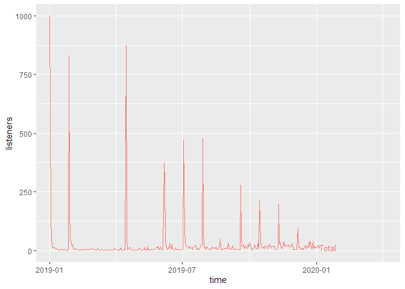
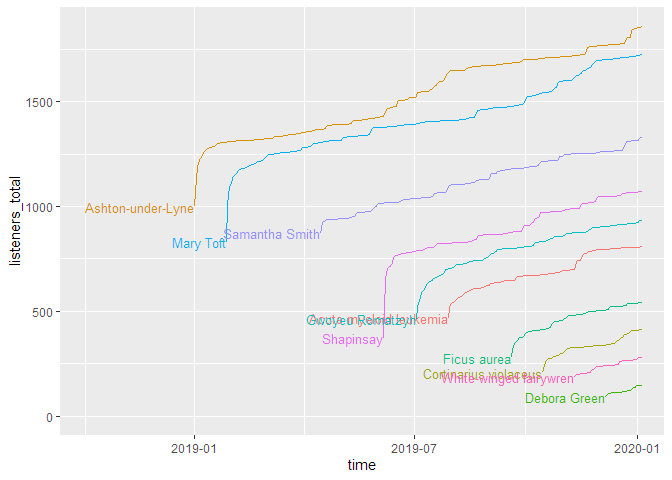
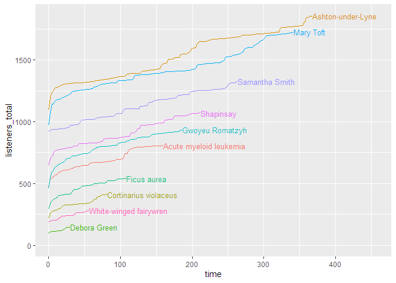
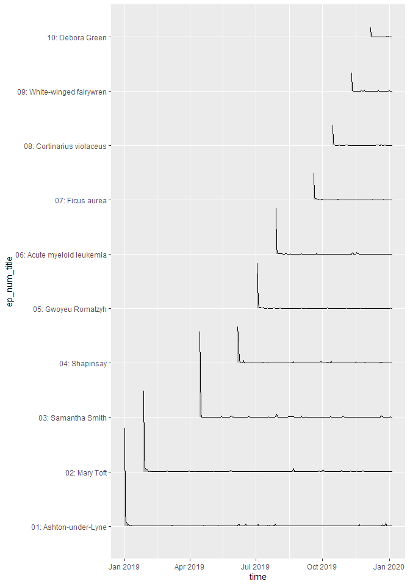
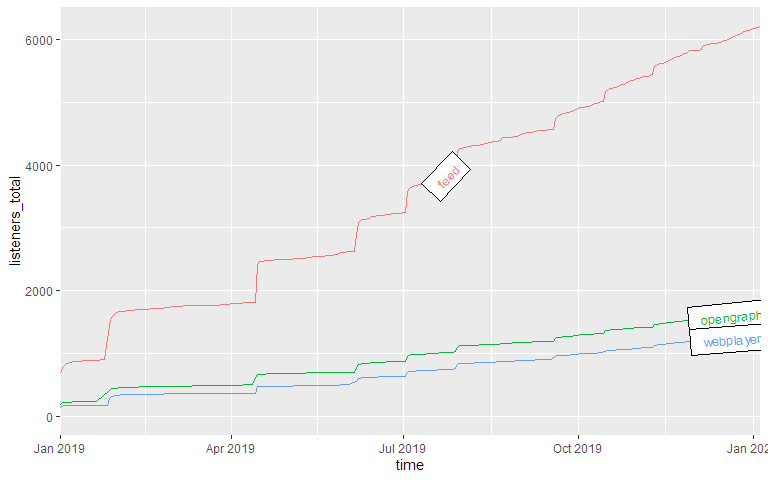
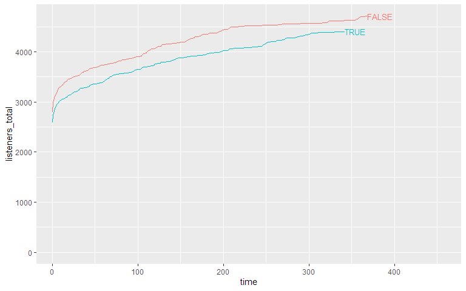
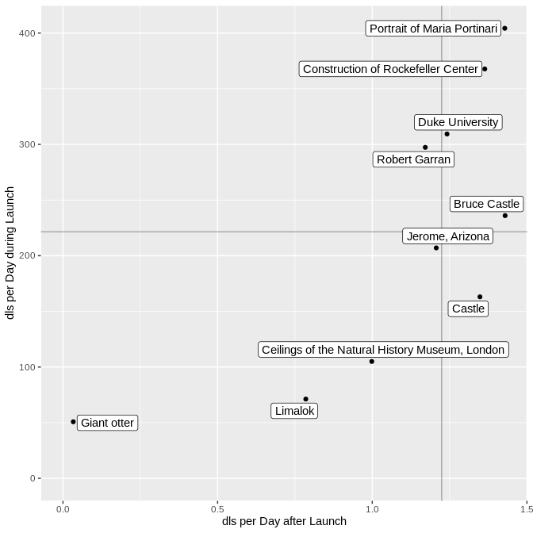
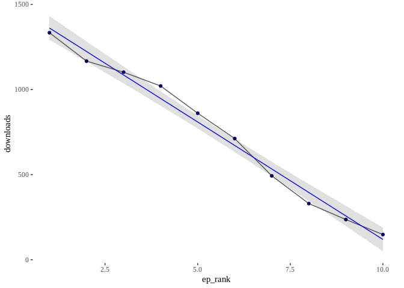

<<<<<<< HEAD
Podlover - A Package to Analyze Podcasting Data
===============================================

=======
>>>>>>> ea5f5af59096ec858a5fee00eb7d3ac30410ffd6
The Backstory: Podlove - a Wordpress plugin for Podcasting
----------------------------------------------------------

The **[Podlove](https://podlove.org/)** podcasting suite is an open
source toolset to help you publish and manage a podcast within a
Wordpress blog. Over the years it has become the de facto standard for
easy while flexible podcast publishing in the German-speaking podcast
community.

Podlove includes an analytics dashboard to give you an overview of how
your podcast is performing over time and various dimensions such as
media formats. While being a practical overview for everyday analytics,
it is limited when it comes to more complex or fine-grained analytics.

podlover Brings Podlove Data into R
-----------------------------------

The `podlover` package allows you to access the access data behind the
Podlove dashboard. It connects to the relevant Wordpress MySQL tables,
fetches the raw data, connects and cleans it into a tidy dataset with
one row per download attempt.

Furthermore, it allows you to:

-   plot download data for multiple episodes as point, line, area and
    ridgeline graphs
-   use options for absolute vs relative display (think: release dates
    vs. days since release) and cumulative vs. non-cumulative display.
-   compare episodes, epsiode formats, sources/contexts, podcast
    clients, and operating systems over time
-   create and compare performance data for episode launches and
    long-term performance
-   calculate and plot regressions to see if you are gaining or losing
    listeners over time.

This vignette demonstrates what `podlover` can do.

Installation
------------

This package is based on the statistical programming framework R. If
you’re a podcast producer who is new R, you will need to install R as
well as its programming environment RStudio and familiarize yourself
with it. Both of them are free open source tools. [Start here to get
RStudio and R](https://rstudio.com/products/rstudio/download/).

`podlover` is available as a package from GitHub at
<a href="https://github.com/lordyo/podlover" class="uri">https://github.com/lordyo/podlover</a>
and can be installed via `devtools`:

    # install devtools if you don't have it already
    install.packages("devtools")

    # install podlover from GitHub
    devtools::install_github("lordyo/podlover")

Once installed, you can load the package.

    library(podlover)

Ways to Access Podlove Data
---------------------------

There are two ways to get your download data into `podlover`:

-   You either **fetch the data directly** from the Wordpress data base
    with `podlove_get_and_clean()`. This will give you the most recent
    data and, once established, is the most comfortable way of accessing
    data. Establishing the connection can be tricky though.
-   Or you **download the necessary tables** and feed it to podlover
    with `podlove_clean_stats()`. This is easier, but takes longer and
    will only give you a snapshot of the data at a certain point in
    time.

Fetching Download Data via a Database Connection
------------------------------------------------

Behind every Wordpress site is a MySQL database containing almost
everything that’s stored in the blog. When installing Podlove under
Wordpress, the plugin creates additional database tables containing
podcast-specific data. The function `podlove_get_and_clean()` fetches
those.

To make that happen, you will need:

1.  `db_name`: The Wordpress database’s name.
2.  `db_host`: The (external) hostname of the database.
3.  `db_user`: The databases’s user name (usually not the same as your
    Wordpress login)
4.  `db_password`: The user’s password for database (usually not the
    same as your Worpdress password)
5.  Permissions to access your database from an external IP address.
6.  The names of the database tables

### Database name, user and password

`db_name`, `db_user` and `db_password` can be found in the
`wp-config.php` file in the root folder of your podcast’s Wordpress
directory. Look for the following passage:

    // ** MySQL settings - You can get this info from your web host ** //
    /** The name of the database for WordPress */
    define( 'DB_NAME', 'lorem_wp_ipsum' );

    /** MySQL database username */
    define( 'DB_USER', 'lorem_dolor' );

    /** MySQL database password */
    define( 'DB_PASSWORD', 'my_password' );

### External Database Hostname

Note that this file also includes a hostname, but this is the internal
hostname - you’re looking for the **external hostname**. This you will
need to get from your hoster’s admin panel, usually where MySQL
databases are managed. Check your hoster’s support section if you get
stuck.

### Access permissions

MySQL databases are sensitive to hacking attacks, which is why they
usually aren’t accessible to just any visitor - even if she has the
correct access information. You will probably need to set allow an
**access permission** to your database and user from the IP address R is
running on (“whitelisting”). This is also done via your hoster’s admin
panel. Check your hoster’s support sections for more info. (Note: Some
hosters are stricter and don’t allow any access except via SSH tunnels.
`podlover` doesn’t provide that option yet.)

### Prefix of the Table Names

Finally, you might need to check if the **tables name prefix** in your
Wordpress database corresponds to the usual naming conventions. Most
Wordpress installations start the tables with `wp_`, but sometimes, this
prefix differs (e.g. `wp_wtig_`). For starters, you can just try to use
the default prefix built into the function. If the prefix is different
than the default, you will get an error message. If that’s the case,
access your hoster’s MySQL management tool (e.g. phpMyAdmin, PHP
Workbench), open your database and check if the tables are starting with
something else than just `wp_...` and write down the prefix. You can of
course also use a locally installed MySQL tool to do so (e.g. HeidiSQL).

### Downloading the data

Once you gathered all this, it’s time to access your data and store it
to a data frame:

    download_data <- podlove_get_and_clean()

Four input prompts will show up, asking for the database name, user,
password and host. You have the option to save these values to your
system’s keyring, so you don’t have to enter them repeatedly. Use
`?rstudioapi::askForSecret` to learn more about where these values are
stored or `?keyring` to learn more how keyrings and how they are used
within R.

After entering the information, you should see something like this:

    connection established
    fetched table wp_podlove_downloadintentclean
    fetched table wp_podlove_mediafile
    fetched table wp_podlove_useragent
    fetched table wp_podlove_episode
    fetched table wp_posts
    connection closed

### Troubleshooting

You might also get an error message, meaning something went wrong. If
you see the following error message…

    Error in .local(drv, ...) : 
      Failed to connect to database: Error: Access denied for user 'username'@'XX.XX.XX.XXX' to database 'databasename'

…then the function couldn’t access the databse. This means either that
there’s something wrong with your database name, user name, password or
host name (see sections “Database name, user name, password” or
“External Database Hostname” above) Or it could mean that access to this
database with this username is restricted, i.e. your IP is not
whitelisted (see “Access Permissions” above). If you can’t make that
work, you’re only option is to download the tables yourself (see
“Working with Local Table Downloads”).

If your error says…

    connection established
    Error in .local(conn, statement, ...) : 
      could not run statement: Table 'dbname.tablename' doesn't exist

…this means you were able to access the database (congrats!), but the
table names/prefix are incorrect. Check your table name prefix as
described under “Prefix of the table names” and try again while
specifying the prefix:

    download_data <- podlove_get_and_clean(tbl_prefix = "PREFIX")

Working with Local Table Downloads
----------------------------------

If you can’t or don’t want to work with `podlove_get_and_clean()`, you
can still analyze your data by downloading the individual database
tables yourself and feed it directly to the cleaning function
`podlove_clean_stats()`.

First, you will need to get the necessary tables. The easiest way is to
use your hoster’s database management tool, e.g. phpMyAdmin or PHP
Workbench. These can usually be accessed from your hosting
administration overview: Look for a “databases”, “MySQL” or “phpMyAdmin”
option, find a list of tables, usually starting with `wp_...`, select
the table and look for an “export” option. Export the tables to CSV. If
you get stuck, check your hoster’s support section.

**Warning: When using database tools, you can break things - i.e. your
site and your podcast. To be on the safe side, always make a backup
first, don’t change any names or options, and don’t delete anything!**

You will need the following tables, each in its own CSV file with
headings (column titles):

-   `wp_podlove_downloadintentclean`
-   `wp_podlove_episode`
-   `wp_podlove_mediafile`
-   `wp_podlove_useragent`
-   `wp_posts`

Note: The prefix of the tables (here `wp_`) might be different or longer
in your case.

Once you have downloaded the tables, you need to import them into R as
data frames: to use the `podlove_clean_stats()` function to connect the
table and clean the data:

    # replace file names with your own
    download_table <- read.csv("wp_podlove_downloadintentclean.csv", as.is = TRUE)
    episode_table <- read.csv("wp_podlove_episode.csv", as.is = TRUE)
    mediafile_table <- read.csv("wp_podlove_mediafile.csv", as.is = TRUE)
    useragent_table <- read.csv("wp_podlove_useragent.csv", as.is = TRUE)
    posts_table <- read.csv("wp_posts.csv", as.is = TRUE)

    # connect & clean the tables
    download_data <- podlove_clean_stats(df_stats = download_table,
                                         df_episode = episode-table,
                                         df_mediafile = mediafile_table,
                                         df_user = useragent_table,
                                         df_posts = posts_table)

Create Example Data
-------------------

`podlover` includes a number of functions to generate example download
tables. This can be useful if you want to test the package without
having real data, or to write reproducible examples for a vignette like
this. We will use an example data set for the next chapters.

Generate some random data with the function `podlove_create_example()`
with ~10.000 downloads in total. The `seed` parameter fixes the
randomization to give you the same data as in this example. The `clean`
parameter states that you want a dataframe of cleaned data, not raw
input tables.

    downloads <- podlove_create_example(total_dls = 10000, seed = 12, clean = TRUE)

Here it is:

    print(downloads)
    #> # A tibble: 6,739 x 20
    #>    ep_number title ep_num_title duration post_date  post_datehour      
    #>    <chr>     <fct> <chr>        <chr>    <date>     <dttm>             
    #>  1 01        Asht~ 01: Ashton-~ 00:32:2~ 2019-01-01 2019-01-01 00:00:00
    #>  2 01        Asht~ 01: Ashton-~ 00:32:2~ 2019-01-01 2019-01-01 00:00:00
    #>  3 01        Asht~ 01: Ashton-~ 00:32:2~ 2019-01-01 2019-01-01 00:00:00
    #>  4 01        Asht~ 01: Ashton-~ 00:32:2~ 2019-01-01 2019-01-01 00:00:00
    #>  5 01        Asht~ 01: Ashton-~ 00:32:2~ 2019-01-01 2019-01-01 00:00:00
    #>  6 01        Asht~ 01: Ashton-~ 00:32:2~ 2019-01-01 2019-01-01 00:00:00
    #>  7 01        Asht~ 01: Ashton-~ 00:32:2~ 2019-01-01 2019-01-01 00:00:00
    #>  8 01        Asht~ 01: Ashton-~ 00:32:2~ 2019-01-01 2019-01-01 00:00:00
    #>  9 01        Asht~ 01: Ashton-~ 00:32:2~ 2019-01-01 2019-01-01 00:00:00
    #> 10 01        Asht~ 01: Ashton-~ 00:32:2~ 2019-01-01 2019-01-01 00:00:00
    #> # ... with 6,729 more rows, and 14 more variables: ep_age_hours <dbl>,
    #> #   ep_age_days <dbl>, hours_since_release <dbl>, days_since_release <dbl>,
    #> #   source <chr>, context <chr>, dldate <date>, dldatehour <dttm>,
    #> #   weekday <ord>, hour <int>, client_name <chr>, client_type <chr>,
    #> #   os_name <chr>, dl_attempts <int>

Nice - this is all the data you need for further analysis. It contains
information about the episode (what was downloaded?), the download (when
was it downloaded?) and the user agent (how / by which agent was it
downloaded?).

By the way, if you want get access the raw data or try out the cleaning
function, you can set the `podlove_create_example()` parameter
`clean = FALSE`:

    table_list <- podlove_create_example(total_dls = 10000, seed = 12)

The result is a list of 5 named tables (`posts`, `episodes`,
`mediafiles`, `useragents`, `downloads`) wrapped in a list. Now all you
have to do is feed them to the cleaning function:

    downloads <- podlove_clean_stats(df_stats = table_list$downloads,
                                     df_mediafile = table_list$mediafiles,
                                     df_user = table_list$useragents,
                                     df_episodes = table_list$episodes,
                                     df_posts = table_list$posts)

Summary
-------

Now that you have the clean download data, it’s time to check it out.
`podlover` includes a simple summary function to give you an overview of
the data:

    podlove_podcast_summary(downloads)
    #> 'downloads': 
    #> 
    #> A podcast with 10 episodes, released between 2019-01-01 and 2019-12-05.
    #> 
    #> Total runtime:  11m 4d 22H 0M 0S.
    #> Average time between episodes: 2928240s (~4.84 weeks).
    #> 
    #> Episodes were downloaded 6739 times between 2019-01-01 and 2020-01-04.
    #> 
    #> Downloads per episode: 673.9
    #> min: 132 | 25p: 375 | med: 703 | 75p: 791 | max: 1327
    #> 
    #> Downloads per day: 18.3
    #> min: 1 | 25p: 3 | med: 7 | 75p: 16 | max: 572
    #> NULL

If you set the parameter `return_params` to `TRUE`, you can access the
individual indicators directly. The `verbose` parameter defines if you
want to see the printed summary.

    pod_sum <- podlove_podcast_summary(downloads, return_params = TRUE, verbose = FALSE)

    names(pod_sum)
    #>  [1] "n_episodes"                 "ep_first_date"             
    #>  [3] "ep_last_date"               "runtime"                   
    #>  [5] "ep_interval"                "n_downloads"               
    #>  [7] "dl_first_date"              "dl_last_date"              
    #>  [9] "downloads_per_episode_mean" "downloads_per_episode_5num"
    #> [11] "downloads_per_day_mean"     "downloads_per_day_5num"

    pod_sum$n_downloads
    #> [1] 6739
    pod_sum$dl_last_date
    #> [1] "2020-01-04 22:00:00 UTC"

Download curves
---------------

One of the main features of the `podlover` package is that it lets you
plot all kinds of download curves over time - aggregated and grouped,
with relative and absolute starting points. The plotting function relies
on the `ggplot2` package and the data needs to be prepared first. The
function `podlove_prepare_stats_for_graph()` does just that, and the
function `podlove_graph_download_curves()` takes care of the plotting.

### Parameters

The functional combo of `podlove_prepare_stats_for_graph()` and
`podlove_graph_download_curves()` accepts the following parameters for a
graph:

-   `df_stats`: The clean data to be analyzed, as prepared by the import
    or cleaning function.
-   `gvar`: The grouping variable. Defining one will create multiple
    curves, one for each group. This needs to be one of the variables
    (columns) in the clean data:
    -   `ep_number`: The episode’s official number
    -   `title`: The episode’s title
    -   `ep_num_title`: The episode’s title with the number in front
    -   `source`: The dowload source - e.g. “feed” for RSS, “webplayer”
        for plays on a website, “download” for file downloads
    -   `context`: The file type for feeds and downloads, “episode” for
        feed accesses
    -   `client_name`: The client application (e.g. the podcatcher’s or
        brower’s name)
    -   `client_type`: A more coarse grouping of the clients,
        e.g. “mediaplayer”, “browser”, “mobile app”.
    -   `os_name`: The operating system’s name of the client
        (e.g. Android, Linux, Mac)
    -   Any other grouping variable you create yourself from the
        existing data.
-   `hourly` (`podlove_prepare_stats_for_graph()` only): If set to
    `TRUE`, the downloads will be shown per hour, otherwise per day
-   `relative` (`podlove_prepare_stats_for_graph()` only): If set to
    `TRUE`, the downloads will be shown relative to their publishing
    date, i.e. all curves starting at 0. Otherwise, the curves will show
    the download on their specific dates.
-   `cumulative` (`podlove_graph_download_curves()` only): If set to
    `TRUE`, the downloads will accumulate and show the total sum over
    time (rising curve). Otherwise, they will uncumulated downloads
    (scattered peaks).
-   `plot_type` (`podlove_graph_download_curves()` only): What kind of
    plot to use - either line plots (`"line"`) on one graph, or
    individual ridgeline plots (`"ridge"`).
-   `labelmethod` (`podlove_graph_download_curves()` only): Where to
    attach the labels (`"first.points"` for the beginning of the line,
    `"last.points"` for the end of the line)

### Total downloads over time

Let’s say you want to see the daily total downloads of your podcast over
time, in accumulated fashion. First, you prepare the graphics data
necessary:

    total_dls_acc <- podlove_prepare_stats_for_graph(df_stats = downloads, 
                                                     hourly = FALSE, 
                                                     relative = FALSE)

Here, you are not specifying any `gvar` (which means you’ll get just one
curve instead of many). `hourly` is set to `FALSE` (= daily data) and
`relative` is set `FALSE` (absolute dates). Now feed this data over to
the plotting function:

    g_tdlacc <- podlove_graph_download_curves(df_tidy_data = total_dls_acc,
                                              cumulative = TRUE, 
                                              plot_type = "line",
                                              printout = FALSE)

    print(g_tdlacc)

If we don’t cumulate the data, we can see the individual spikes of the
episode launches:

    g_tdl <- podlove_graph_download_curves(df_tidy_data = total_dls_acc,
                                              cumulative = FALSE, 
                                              plot_type = "line",
                                              printout = FALSE)

    print(g_tdl)

### Downloads by episode

Now you want to look at the individual episodes. For this, you will need
to use the `gvar` parameter. For an episode overviewer, you can either
set it to `title`, `ep_number` or `ep_num_title`. Here, we’re using
`title` (unquoted!), and add specify the `labelmethod` to show the
labels at the beginning of the curves.

    ep_dls_acc <- podlove_prepare_stats_for_graph(df_stats = downloads,  
                                                  gvar = title, # group by episode title
                                                  hourly = FALSE,  
                                                  relative = FALSE)

    g_ep_dlsacc <- podlove_graph_download_curves(df_tidy_data = ep_dls_acc,
                                                 gvar = title, # use the same gvar!
                                                 cumulative = TRUE,
                                                 plot_type = "line", 
                                                 labelmethod = "first.points",
                                                 printout = FALSE)

    print(g_ep_dlsacc)

As you can see, this shows the curves spread over the calendar X axis.
But how do the episodes hold up against each other? For this, we will
use the parameter `relative = TRUE`, which lets all curves start at the
same point. The labelling paramter `labelmethod = "last.points"` works
better for this kind of curve.

    ep_dls_acc_rel <- podlove_prepare_stats_for_graph(df_stats = downloads,  
                                                  gvar = title,
                                                  hourly = FALSE,  
                                                  relative = TRUE) # relative plotting

    g_ep_dlsaccrel <- podlove_graph_download_curves(df_tidy_data = ep_dls_acc_rel,
                                                 gvar = title,
                                                 cumulative = TRUE,
                                                 plot_type = "line", 
                                                 labelmethod = "last.points",
                                                 printout = FALSE)

    print(g_ep_dlsaccrel)

If you want to look at the uncumulated data, the line plot doesn’t work
very well. For this, a ridge plot is the right choice (but only if you
don’t have too many episodes):

    ep_dls <- podlove_prepare_stats_for_graph(df_stats = downloads,  
                                                  gvar = ep_num_title, # better for sorting
                                                  hourly = FALSE,  
                                                  relative = FALSE)

    g_ep_dls <- podlove_graph_download_curves(df_tidy_data = ep_dls,
                                                 gvar = ep_num_title,
                                                 cumulative = FALSE, # no cumulation
                                                 plot_type = "ridge", # use a ridgeline plot
                                                 printout = FALSE)

    print(g_ep_dls)

### Downloads by other parameters

You can compare not only episodes, but also aspects of episodes or
downloads. Let’s look at the parameter `source`, which lists by what way
our listeners get their episodes. The labelmethod here is set to
`angled.boxes`:

    source_acc <- podlove_prepare_stats_for_graph(df_stats = downloads,  
                                                  gvar = source, # new gvar
                                                  hourly = FALSE,  
                                                  relative = FALSE) 

    g_source_acc <- podlove_graph_download_curves(df_tidy_data = source_acc,
                                                 gvar = source,  # same as above!
                                                 cumulative = TRUE,
                                                 plot_type = "line", 
                                                 labelmethod = "angled.boxes",
                                                 printout = FALSE)

    print(g_source_acc)

Epsiode Performance
-------------------

Podcast episode downloads typically follow a “heavy front, long tail”
distribution: Many downloads are made over automatic downloads by
podcatchers, while fewer are downloaded in the long-term. It therefore
helps to distinguish between the episode launch period (the heavy front)
and the long term performance (the long tail). For this, you can use the
function `podlove_performance_stats()`, which creates a table of
performance stats per episode. For this, you will first need to define
how long a “launch” goes and when the long-term period starts. Those two
don’t have to be the same. Here, we’ll use 0-3 days for the launch and
30 and above for the long-term.

    perf <- podlove_performance_stats(downloads, launch = 3, post_launch = 30)

    perf
    #> # A tibble: 10 x 5
    #>    title               dls dls_per_day dls_per_day_at_lau~ dls_per_day_after_la~
    #>    <fct>             <int>       <dbl>               <dbl>                 <dbl>
    #>  1 Acute myeloid le~   669        4.17               131                  1.20  
    #>  2 Ashton-under-Lyne  1243        3.37               198.                 1.46  
    #>  3 Cortinarius viol~   375        4.57                75.4                1.05  
    #>  4 Debora Green        132        4.40                39                  0.0333
    #>  5 Ficus aurea         461        4.26                86.2                1.17  
    #>  6 Gwoyeu Romatzyh     776        4.16               132.                 1.23  
    #>  7 Mary Toft          1327        3.87               226.                 1.49  
    #>  8 Samantha Smith      737        2.79               133.                 1.38  
    #>  9 Shapinsay           791        3.72               140                  1.33  
    #> 10 White-winged fai~   228        4.07                61.5                0.732

    colnames(perf)
    #> [1] "title"                    "dls"                     
    #> [3] "dls_per_day"              "dls_per_day_at_launch"   
    #> [5] "dls_per_day_after_launch"

The table shows four values per episode: The overall downlaods, the
overall average downloads, the average downloads during the launch and
the average downloads during the post-launch period. If you want to see
a ranking of the best launches, you can just sort the list:

    perf %>%
      dplyr::select(title, dls_per_day_at_launch) %>% 
      dplyr::arrange(desc(dls_per_day_at_launch))
    #> # A tibble: 10 x 2
    #>    title                  dls_per_day_at_launch
    #>    <fct>                                  <dbl>
    #>  1 Mary Toft                              226. 
    #>  2 Ashton-under-Lyne                      198. 
    #>  3 Shapinsay                              140  
    #>  4 Samantha Smith                         133. 
    #>  5 Gwoyeu Romatzyh                        132. 
    #>  6 Acute myeloid leukemia                 131  
    #>  7 Ficus aurea                             86.2
    #>  8 Cortinarius violaceus                   75.4
    #>  9 White-winged fairywren                  61.5
    #> 10 Debora Green                            39

So there are episodes with different launches strengths long-term
performance. Can you plot them against each other? Yes, you can! The
function `podlove_graph_performance()` gives you a nice four-box grid.
The top right corner is showing “evergreen” episodes with strong
launches and long-term performance, the top left the “shooting stars”
with strong launches and loss of interest over time, the bottom right
shows “slow burners” which took a while to get an audience, and the
bottom left is showing… well, the rest.

    g_perf <- podlove_graph_performance(perf, printout = FALSE)

    print(g_perf)

Regression Analysis: Is your podcast gaining or losing listeners?
-----------------------------------------------------------------

The one question every podcast producer is asking themselves is: “Is my
podcast’s audience growing?”. This is not an easy question to answer,
because you’re dealing with lagging time series data. One approach to
deal answer the question is to calculate a regression model of downloads
against time or episode number (tip of the hat to [Bernhard Fischer, who
prototyped this
idea](https://community.podlove.org/t/implementation-of-regression-prototype/1994)).
If the number of downloads after a specified date after launch is rising
over time, the podcast is gaining listeners. If it falls, it’s losing
listeners. If it stays stable, it’s keeping listeners.

To prepare the regression, you first need to use the function
`podlove_downloads_until()` to create a dataset of downloads at a
specific point. The longer the period between launch and measuring point
is, the more valid the model will be - but you’ll also have less data
points. For this example, we’ll pick a period of 30 days after launch:

    du <- podlove_downloads_until(downloads, 30)

    du
    #> # A tibble: 10 x 12
    #>    ep_number title ep_num_title duration post_date  post_datehour      
    #>    <chr>     <fct> <chr>        <chr>    <date>     <dttm>             
    #>  1 01        Asht~ 01: Ashton-~ 00:32:2~ 2019-01-01 2019-01-01 00:00:00
    #>  2 02        Mary~ 02: Mary To~ 00:46:0~ 2019-01-27 2019-01-27 01:00:00
    #>  3 03        Sama~ 03: Samanth~ 00:30:3~ 2019-04-15 2019-04-15 06:00:00
    #>  4 04        Shap~ 04: Shapins~ 00:41:1~ 2019-06-06 2019-06-06 10:00:00
    #>  5 05        Gwoy~ 05: Gwoyeu ~ 00:27:0~ 2019-07-02 2019-07-02 12:00:00
    #>  6 06        Acut~ 06: Acute m~ 00:23:4~ 2019-07-28 2019-07-28 13:00:00
    #>  7 07        Ficu~ 07: Ficus a~ 00:33:2~ 2019-09-18 2019-09-18 17:00:00
    #>  8 08        Cort~ 08: Cortina~ 00:19:0~ 2019-10-14 2019-10-14 18:00:00
    #>  9 09        Whit~ 09: White-w~ 00:18:3~ 2019-11-09 2019-11-09 20:00:00
    #> 10 10        Debo~ 10: Debora ~ 00:28:5~ 2019-12-05 2019-12-05 22:00:00
    #> # ... with 6 more variables: ep_age_hours <dbl>, ep_age_days <dbl>,
    #> #   ep_rank <int>, measure_day <dbl>, measure_hour <dbl>, downloads <int>

This dataset we can feed into the regression function
`podlove_episode_regression()`. You can choose if you want to use the
`post_datehour` parameter (better if your episodes don’t come out
regularly), or `ep_rank`, which corresponds to the episode number (it
has a different name because episode numbers are strings):

    reg <- podlove_episode_regression(du, terms = "ep_rank")

If you’re statistically inclined, you can check out the model directly
and see if your model is significant:

    summary(reg)
    #> 
    #> Call:
    #> stats::lm(formula = formula_string, data = df_regression_data)
    #> 
    #> Residuals:
    #>     Min      1Q  Median      3Q     Max 
    #> -222.21  -23.69  -11.74   57.09  155.70 
    #> 
    #> Coefficients:
    #>             Estimate Std. Error t value Pr(>|t|)    
    #> (Intercept)   789.47      71.28  11.075 3.94e-06 ***
    #> ep_rank       -64.08      11.49  -5.578 0.000523 ***
    #> ---
    #> Signif. codes:  0 '***' 0.001 '**' 0.01 '*' 0.05 '.' 0.1 ' ' 1
    #> 
    #> Residual standard error: 104.3 on 8 degrees of freedom
    #> Multiple R-squared:  0.7955, Adjusted R-squared:  0.7699 
    #> F-statistic: 31.12 on 1 and 8 DF,  p-value: 0.0005233

Or you could just check out the regression plot with the function
`podlove_graph_regression()` and see in which direction the line points:

    g_reg <- podlove_graph_regression(du, predictor = ep_rank)

Oh noes! It seems like your podcast is steadily losing listeners at the
rate of -64 listeners per episode!

Finally
-------

There could be much more possible with Podlove data and R and
`podlover`. For example, some of the download data have not yet been
included in the import script, such as the geolocation data. Some of the
functions are still too manual and require wrapping functions to quickly
analyze data. If you want to contribute, check out the GitHub repo
under:

<a href="https://github.com/lordyo/podlover" class="uri">https://github.com/lordyo/podlover</a>

And if you want to use or contribute to the Podlove project (the
Podcasting tools), check out:

<a href="https://podlove.org" class="uri">https://podlove.org</a>
